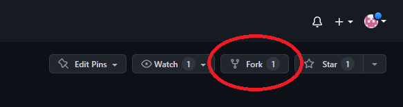
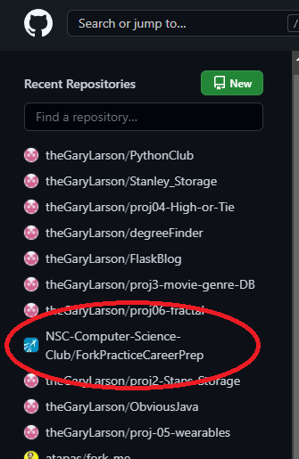
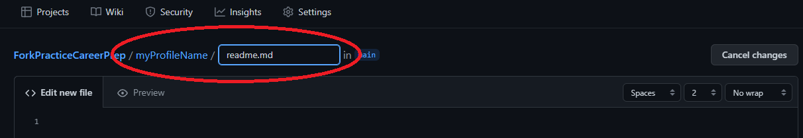
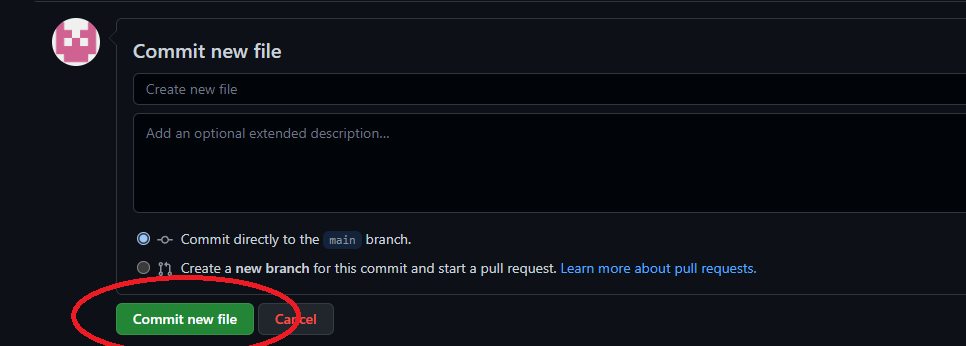
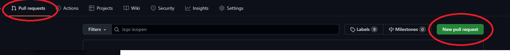
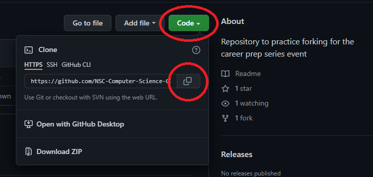

# GitHub Workflow

1. Fork this repository 
   *Done from NSC GitHub Repository (click link below)*  
   <a href="https://github.com/NSC-Computer-Science-Club/ForkPracticeCareerPrep" target="_blank">https://github.com/NSC-Computer-Science-Club/ForkPracticeCareerPrep</a>
   

2. The repo will appear under your profile. Click this repository (We will do our work from here).

> *For a Deeper dive Using Git Bash command line. Follow Steps **A** thru **G** Under **Terminal Commands*** below

3. Click the green "Add file" button. Select "Create new file"

4. At the top of the file will be a textbox to name your file. Include the subfolder. Typing the name of the subfolder and then a forward-slash will indicate a new folder. Then type readme.md

5. Then add markdown of your choosing to illustrate what you learned. Here is a <a href="https://stackedit.io" target="_blank">web tool</a> to help with markdown.

6. Once you are satisfied with your changes. Save your file by scrolling down and clicking the green "Commit new file" button.

7. From your GitHub Profile submit a pull request

---
## Terminal Commands
---
**Switch to the GitBash terminal**

On your computer navigate to the folder where you want to store your copy within the Git Bash terminal. Cloning will create a subfolder including all the files within the repository.

A. Clone this repository `git clone https://github.com/NSC-Computer-Science-Club/ForkPracticeCareerPrep.git`

**Switch to your file management system**

B. Create a subfolder within this copied repository. Name it your GitHub profile user name.

C. In this folder create a README.md file

D. Open this file and add your markdown and save the file.

**Switch to the GitBash terminal**

E. add your changes from the terminal `git add .`

F. Commit your changes `git commit -m "My created subfolder with markdown file."`

G. Push your changes to your GitHub Profile repository `git push origin main`

---
> Continue with **step 7** above
---

Happy to have yall here <3

Good luck :)

You got this

-Raahil
